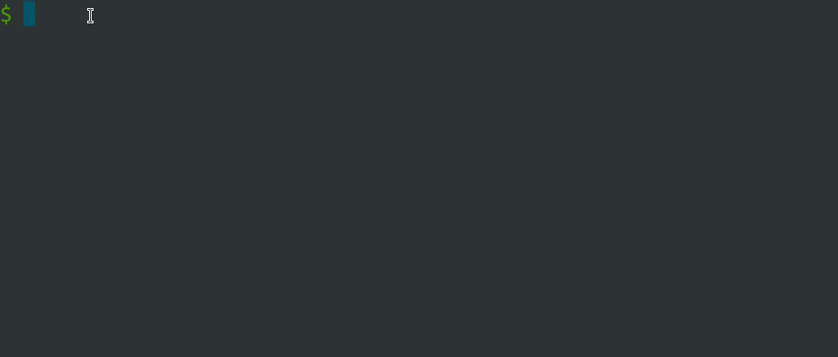

# Clirio

A mini framework for Node.js command-line interfaces built around TypeScript, decorators, and DTOs

Clirio is a routing and data-control library for terminal commands. It helps you describe CLI commands as modules and actions, map raw input into typed DTOs, and keep validation and transformation close to the place where a command is handled. In that sense, it can be used as an alternative to tools like [commander](https://www.npmjs.com/package/commander), [args](https://www.npmjs.com/package/args), [argparse](https://www.npmjs.com/package/argparse) and others.

The [author](https://github.com/stepanzabelin) is inspired by [angular](https://github.com/angular) and [nestjs](https://github.com/nestjs/nest)

You can also combine Clirio with interactive command-line libraries such as [inquirer](https://www.npmjs.com/package/inquirer), [terminal-kit](https://www.npmjs.com/package/terminal-kit), [chalk](https://www.npmjs.com/package/chalk), and others.

The Clirio starter kit is [here](https://github.com/stepanzabelin/clirio-starter-kit)



#### Table of Contents

- [Clirio](#clirio)
  - [Installation](#installation)
  - [Quick Start](#quick-start)
  - [Starter kit](#starter-kit)
  - [Definitions](#definitions)
  - [Parsing args](#parsing-args)
  - [App configuration](#app-configuration)
  - [Modules](#modules)
  - [Actions](#actions)
    - [Command patterns](#command-patterns)
    - [Empty command](#empty-command)
    - [Failure command](#failure-command)
  - [Data control](#data-control)
    - [Params](#params-data-control)
    - [Options](#options-data-control)
    - [Envs](#envs-data-control)
  - [Input DTO](#input-dto)
    - [Validation](#validation)
    - [Transformation](#transformation)
  - [Pipes](#pipes)
  - [Exceptions](#exceptions)
  - [Filters](#filters)
  - [Displaying help](#displaying-help)
    - [Clirio Helper](#clirio-helper)
    - [Hidden commands](#hidden-commands)
  - [Displaying Version](#displaying-version)
  - [Clirio API](#clirio-api)
    - [setConfig](#setconfig)
    - [setGlobalPipe](#setglobalpipe)
    - [setGlobalFilter](#setglobalfilter)
    - [addModule](#addmodule)
    - [setModules](#setmodules)
    - [execute](#execute)
  - [Clirio utils](#clirio-utils)
    - [valid](#cliriovalid)
    - [form](#clirioform)
    - [parse](#clirioparse)
    - [describe](#cliriodescribe)
  - [Decorators](#decorators)
    - [Command](#command-decorator)
    - [Empty](#empty-decorator)
    - [Env](#env-decorator)
    - [Envs](#envs-decorator)
    - [Filter](#filter-decorator)
    - [Failure](#failure-decorator)
    - [Helper](#helper-decorator)
    - [Module](#module-decorator)
    - [Option](#option-decorator)
    - [Options](#options-decorator)
    - [Param](#param-decorator)
    - [Params](#params-decorator)
    - [Pipe](#pipe-decorator)
    - [Transform](#transform-decorator)
    - [Validate](#validate-decorator)

## Installation

```bash
npm install clirio

```

```bash
yarn add clirio

```

## Quick Start

There are 3 easy steps to build a Clirio app.

The example below emulates the `git status` CLI command with options.

1. Create a DTO to describe input options

```ts
import { Option } from 'clirio';

class GitStatusDto {
  @Option('--branch, -b')
  readonly branch?: string;

  @Option('--ignore-submodules')
  readonly ignoreSubmodules?: string;

  @Option('--short, -s')
  readonly short?: null;
}
```

2. Create a module to group related commands

```ts
import { Module, Command, Options } from 'clirio';

@Module()
export class GitModule {
  @Command('git status')
  public status(@Options() options: GitStatusDto) {
    // handled data is available here
    console.log(options);
  }
}
```

3. Configure the main class

```ts
import { Clirio } from 'clirio';

const clirio = new Clirio();
clirio.addModule(GitModule);
clirio.execute();
```

##### Result

```bash
$ my-cli git status -b master --ignore-submodules  all --short
```


The command `git status` will be routed to the `GitModule.status` method.

```console
{ branch: 'master', ignoreSubmodules: 'all', short: null }
```


At this point you can use the received data in your own application logic.

The implementation of your own CLI entrypoint (for example `my-cli`) is described in the [starter kit](https://github.com/stepanzabelin/clirio-starter-kit)


#### The way with typing, validation, transformation

The `GitStatusOptionsDto` entity can be made stricter with validation and transformation rules.


```ts
import { Clirio, Option, Validate, Transform } from 'clirio';

class GitStatusOptionsDto {
  @Option('--branch, -b')
  @Validate(Clirio.valid.STRING)
  readonly branch: string;

  @Option('--ignore-submodules, -i')
  @Validate((v) => ['none', 'untracked','dirty', 'all'].includes(v))
  readonly ignoreSubmodules: 'none' | 'untracked' | 'dirty' | 'all';

  @Option('--short, -s')
  @Transform(Clirio.form.FLAG)
  readonly short: boolean;
}
```

```ts
@Module()
export class GitModule {
  @Command('git status')
  public status(@Options() options: GitStatusOptionsDto) {
    // "options" has already been typed, validated, and transformed here
    console.log(`branch: ${options.branch}`);
    console.log(`ignoreSubmodules: ${options.ignoreSubmodules}`);
    console.log(`short: ${options.short}`);
  }
}
```

##### Result

```bash
$ my-cli git status -b master --ignore-submodules  all --short
```

```console
  branch: master
  ignoreSubmodules: all
  short: true
```

The details are described below.

## Starter kit

Clirio is designed in a way that works well with SOLID-style architecture, OOP, dependency injection, and other common application patterns.

The **[Clirio starter kit](https://github.com/stepanzabelin/clirio-starter-kit)** contains a recommended project setup, but you can also integrate Clirio with your own libraries, containers, and custom decorators.

## Definitions

The anatomy of a shell CLI is described in [wiki](https://en.wikipedia.org/wiki/Command-line_interface#Anatomy_of_a_shell_CLI)

The following definitions are used throughout the Clirio documentation.

##### Bash example

```bash
$  node migration-cli.js run 123556 -u user -p pass --db="db-name"
```

##### The incoming command-line

| node migration-cli.js | run 123556 -u user -p pass --db="db-name" |
| :-------------------: | :---------------------------------------: |
|      launch path      |                 arguments                 |

##### The parsed command-line

| node migration-cli.js | run 123556 | -u user -p pass --db="db-name" |
| :-------------------: | :--------: | :----------------------------: |
|      launch path      |  command   |            options             |

##### The matched command-line

| node migration-cli.js |  run   | 123556 | -u user | -p pass | --db="db-name" |
| :-------------------: | :----: | :----: | :-----: | :-----: | :------------: |
|      launch path      | action | param  | option  | option  |     option     |

##### Arguments Definition

"Arguments" are all space-separated command-line parts after `launch path`

##### Command Definition

"Command" is the space-separated part of the input without leading dashes

##### Params Definition

"Params" are values obtained by matching a command against a command pattern

##### Options Definition

"Options" are command-line parts that start with one or more leading dashes

Each option is either a key-value pair or a standalone key. If an option starts with two dashes it is treated as a long key; if it starts with one dash it is treated as a short key, which must be one character long:

`--name=Alex`, `--name Alex`, `-n Alex`, `--version`, `-v`

## Parsing args

This is how Clirio parses a command-line:

```ts
Clirio.parse('test --foo 15 -b -a -r 22');
```

```ts
Clirio.describe(['test', '--foo=15', '-b', '-a', '-r', '22']);
```

Result:

```json
[
  { "type": "action", "key": 0, "value": "test" },
  { "type": "option", "key": "foo", "value": "15" },
  { "type": "option", "key": "b", "value": null },
  { "type": "option", "key": "a", "value": null },
  { "type": "option", "key": "r", "value": "22" }
]
```

Another example:

```bash
$ my-cli set-time 10:56 --format=AM -ei 15
```

| type   | key      | value      |
| ------ | -------- | ---------- |
| action | 0        | "set-time" |
| action | 1        | "10:56"    |
| option | "format" | "AM"       |
| option | "e"      | null       |
| option | "i"      | "15"       |

##### Summary

- all parts of the command-line without a leading dash will be described as actions
- any action has keys as a numerical index in ascending order
- any option with a missing value will be `null`
- any option starting with a single dash will be separated by letters
- all options will be parsed into key-value
- the raw value of any options can be a `string` or `null`

## App configuration

The application usually consists of the following parts:

1. the main class: `Clirio`
2. modules: custom classes or their instances
3. actions: methods in those modules decorated with Clirio decorators

`Clirio` is the main class. It configures the application and links modules together.

```ts
const cli = new Clirio();
cli.setModules([HelloModule, CommonModule, GitModule, MigrationModule]);
cli.execute();
```

Modules can be instantiated manually if you want to plug in dependency injection.

```ts
cli.setModules([
  HelloModule,
  new CommonModule(),
  diContainer.resolve(CommonModule),
]);
```

An example of that setup is available in the [starter kit](https://github.com/stepanzabelin/clirio-starter-kit)

## Modules

Clirio modules are custom classes marked with the `@Module()` decorator. You can think of them as controllers for your CLI.
An application can have one module or many. Each module contains actions that describe command patterns.

Using a single common module:

```ts
@Module()
export class CommonModule {
  @Command('hello there')
  public helloThere() {
    // ...
  }

  @Command('migration run')
  public migrationRun() {
    // ...
  }
}
```

As a result, 2 commands will be available:

```bash
$ my-cli hello there
$ my-cli migration run
```

Using multiple modules helps separate unrelated commands and keep the code organized:

```ts
@Module('hello')
export class HelloModule {
  @Command('there')
  public helloThere() {
    // ...
  }
}

@Module('migration')
export class MigrationModule {
  @Command('run')
  public run() {
    // ...
  }
}
```

## Actions

Clirio actions are methods inside modules decorated with Clirio action decorators.

```ts
@Module()
export class HelloModule {
  @Command('hello')
  public helloThere() {
    console.log('Hello! It works!');
  }

  @Command('bye')
  public help() {
    console.log('Bye! See you later');
  }

  @Empty()
  public empty() {
    console.log(chalk.yellow('You have not entered anything'));
  }

  @Failure()
  public failure() {
    console.log(chalk.red('You have entered a non-existent command'));
  }
}
```

### Command patterns

The `@Command()` decorator is used to define a command pattern.

```ts
@Module()
export class MigrationModule {
  @Command('init')
  public initMigration() {}

  @Command('migration run|up')
  public runMigration() {}

  @Command('migration to <name>')
  public migrateTo() {}

  @Command('migration merge <name1> <name2>')
  public mergeMigrations() {}

  @Command('migration delete <...names>')
  public deleteMigrations() {}
}
```

The final pattern is built from `@Module(...)` and `@Command(...)`, then matched against the command-line.

A pattern can consist of one or more space-separated arguments.

##### Case 1. Exact match

The exact command will be matched.

```ts
  @Command('hello')
  @Command('hello my friends')
```

| Command pattern  | Matching command-line |
| ---------------- | --------------------- |
| hello            | hello                 |
| hello there      | hello there           |
| hello my friends | hello my friends      |

##### Case 2. Match variants

Use the `|` operator to set match variants. Multiple command-lines can be routed to the same action. The number of space-separated parts must stay the same.

```ts
  @Command('migration run|up')
  @Command('hello|hey|hi')
```

| Command pattern   | Matching command-line          |
| ----------------- | ------------------------------ |
| migration run\|up | migration run<br> migration up |
| hello\|hey\|hi    | hello<br> hey<br> hi           |

##### Case 3. Pattern with value masks

Use the `< >` operator to mark a position that can contain any value. The number of space-separated parts must still match.

```ts
  @Command('hello <first-name> <last-name>')
  @Command('set-time <time>')
```

| Command pattern                    | Matching command-line                                                |
| ---------------------------------- | -------------------------------------------------------------------- |
| hello \<first-name\> \<last-name\> | hello Alex Smith<br>hello John Anderson<br> ... etc.                 |
| set-time \<time\>                  | set-time 11:50<br> set-time now<br> set-time 1232343545<br> ... etc. |

Use [Params data control](#params-data-control) to receive those values in a DTO.

##### Case 4. Pattern with rest values mask

Use the `<... >` operator to capture an array of values.
Only one rest mask can appear in a command pattern, and it must be at the end.

```ts
  @Command('hello <...all-names>')
  @Command('get cities <...cities>')
```

| Command pattern          | Matching command-line                                               |
| ------------------------ | ------------------------------------------------------------------- |
| hello \<...all-names\>   | hello Alex John Sarah Arthur<br/> hello Max<br> ... etc.            |
| get cities \<...cities\> | get cities Prague New-York Moscow<br>get cities Berlin<br> ... etc. |

Use [Params data control](#params-data-control) to get the entered values

##### Case 5. Option match

This pattern is designed for special cases such as "help" and "version". It performs an exact match against an option-style command. Match variants can be separated by commas.

```ts
  @Command('--help, -h')
  @Command('--mode=check')
```

| Command pattern | Matching command-line |
| --------------- | --------------------- |
| --help, -h      | --help<br/> -h        |
| --version, -v   | --version<br/> -v     |
| --mode=check    | --mode=check          |

Use [Options data control](#options-data-control) if you want that command to accept additional options.
To avoid ambiguous matching, do not mix this pattern with other kinds of command patterns.

## Empty command

The `@Empty()` action decorator lets a module handle the case when nothing is entered.
Each module can declare its own `@Empty()` action.

```ts
@Module()
export class CommonModule {
  @Command('hello')
  public hello() {}

  @Empty()
  public empty() {
    console.log("You haven't entered anything");
  }
}
```

```bash
$ my-cli
```

```console
You haven't entered anything
```

When a module has a command prefix, empty handlers are matched and ranked by that prefix.

```ts
@Module('migration')
export class MigrationModule {
  @Command('init')
  public initMigration() {}

  @Empty()
  public empty() {
    console.log(
      'The migration module requires additional instruction. Type --help',
    );
  }
}
```

```bash
$ my-cli migration
```

```console
The migration module requires additional instruction. Type --help
```

### Failure command

The `@Failure()` action decorator lets a module handle the case when command patterns do not match.

Each module can declare its own `@Failure()` action.

If this decorator is not specified, Clirio throws a default error.

```ts
@Module()
export class CommonModule {
  @Command('hello')
  public hello() {}

  @Failure()
  public failure() {
    console.log('There is no such a command!');
  }
}
```

```bash
$ my-cli goodbye
```

```console
There is no such a command!
```

When a module has a command prefix, failure handlers are matched and ranked by that prefix.

```ts
@Module('migration')
export class MigrationModule {
  @Command('init')
  public initMigration() {}

  @Failure()
  public failure() {
    console.log('The migration module got the wrong instruction');
  }
}
```

```bash
$ my-cli migration stop
```

```console
The migration module got the wrong instruction
```

## Data control

Clirio uses [parameter decorators](https://www.typescriptlang.org/docs/handbook/decorators.html) to control input data.
The `@Params()` and `@Options()` decorators are provided for this purpose.

```ts
@Module()
export class LocatorModule {
  @Command('get-location <city>')
  public getLocation(@Params() params: unknown, @Options() options: unknown) {
    console.log(params);
    console.log(options);
  }
}
```

```bash
$ my-cli get-location Prague --format=DMS --verbose
```

```console
{ city: "Prague" }
{ format: "DMS", verbose: null }
```

### Params data control

To handle incoming data in a typed way, use DTOs instead of `unknown`.

### Params DTO

The `@Param()` decorator is provided for DTO properties. It can take the name of a param mask and map it to a DTO property.

```ts
export class HelloParamsDto {
  @Param('first-name')
  readonly firstName?: string;

  @Param('last-name')
  readonly lastName?: string;
}
```

```ts
@Module()
export class HelloModule {
  @Command('hello <first-name> <last-name>')
  public hello(@Params() params: HelloParamsDto) {
    console.log(params);
  }
}
```

Here the second and third parts of the command-line are value masks.
The `hello` method will be called when the user enters a three-part command. The last two parts are passed into the params DTO.

```bash
$ my-cli hello Alex Smith
```

```console
{ firstName: "Alex", lastName: "Smith" }
```

The `@Param()` decorator can be used without arguments. In that case, DTO properties are mapped to input keys with the same name.
If the `@Param()` decorator is absent, no mapping is performed for that property.

```ts
export class HelloParamsDto {
  @Param()
  readonly 'first-name'?: string;

  @Param()
  readonly 'last-name'?: string;
}
```

```bash
$ my-cli hello Alex Smith
```

```console
{ "first-name": "Alex", "last-name": "Smith" }
```

##### Example with the rest values mask

```ts
@Module()
export class GitModule {
  @Command('git add <...all-files>')
  public add(@Params() params: AddParamsDto) {
    // Type checking works for "params" variable
    console.log(params.allFiles);
  }
}
```

```ts
class AddParamsDto {
  @Param('all-files')
  readonly allFiles: string[];
}
```

```bash
$ my-cli git add test.txt logo.png
```

```console
{ allFiles: ['test.txt', 'logo.png'] }
```

### Options data control

The `@Options()` decorator is provided for command options.

```ts
@Module()
export class GitModule {
  @Command('git status')
  public status(@Options() options: GitStatusOptionsDto) {
    console.log(options);
  }
}
```

### Options DTO

The `@Option()` decorator is provided for DTO properties. It can accept comma-separated key aliases and map them to a DTO property.

```ts
class GitStatusOptionsDto {
  @Option('--branch, -b')
  readonly branch?: string;

  @Option('--ignore-submodules, -i')
  readonly ignoreSubmodules?: string;

  @Option('--short, -s')
  @Transform(Clirio.form.FLAG)
  readonly short?: boolean;
}
```

```bash
$ my-cli git status --branch=master --ignore-submodules=all --short

$ my-cli git status --branch master --ignore-submodules all --short

$ my-cli git status -b master -i all -s

```

Each of these inputs leads to the same result:

```console
{ branch: 'master', ignoreSubmodules: 'all', short: true }
```

If the `@Option()` decorator is absent, no mapping is performed for that property.

```bash
$ my-cli git status --branch=master --ignore-submodules=all --short
```

```console
{ branch: 'master', 'ignore-submodules': 'all', short: null }
```

## Input DTO

DTOs used to control input can have additional decorators, including custom ones.
Before validation and transformation, every incoming value is one of the following raw forms:

```ts
type Value = string | null | (string | null)[];
```

##### example of data control (options and params)

```ts
@Module()
export class SomeModule {
  @Command('set-limit <limit>')
  public setLimit(
    @Params() params: SetLimitParamsDto,
    @Options() options: SetLimitOptionDto,
  ) {
    console.log(params);
    console.log(options);
  }
}
```

Clirio provides the `@Validate()` and `@Transform()` decorators.
In this example they are used on DTO properties such as `SetLimitParamsDto` and `SetLimitOptionDto`.

```ts
import { Option, Validate, Transform } from 'clirio';
import { MyCustomDecorator } from 'src/my-decorators';

class SetLimitParamsDto {
  @Param('limit')
  @Validate((v) => /^[0-9]+$/.test(String(v))) // accept digits only
  @Transform((v) => Number(v)) // transform string to number
  @MyCustomDecorator() // can be handled later in a pipe
  readonly limit: number;
}
```

### Envs data control

The `@Envs()` decorator is provided for environment variables.

```ts
import { Envs } from 'clirio';

@Module('migration')
export class MigrationModule {
  @Command('test-connect')
  public testConnect(@Envs() envs: TestConnectEnvsDto) {
    // ...
  }
}
```

### Envs DTO

The `@Env()` decorator is provided for DTO properties.

```ts
import { Env } from 'clirio';

export class TestConnectEnvsDto {
  @Env('DB_HOST')
  readonly host: string;

  @Env('DB_PORT')
  @Transform((v) => Number(v))
  readonly port: number;

  @Env('DB_USER')
  readonly user: string;

  @Env('DB_PASSWORD')
  readonly password: string;
}
```

### Validation

The `@Validate()` decorator is provided to check input params, options, and envs.
It should be used on DTO properties together with `@Option()`, `@Param()`, or `@Env()`, depending on the kind of controlled data.
`@Validate()` accepts either a single function or an array of functions. The functions are executed from left to right, and each one must return `boolean` or `null`:

- if a function returns `false`, Clirio throws a validation error immediately
- if a function returns `null`, Clirio moves on to the next validator in the chain
- if a function returns `true`, the validation chain for that property stops successfully

This makes validator order important. Guard validators such as `OPTIONAL` and `NULLABLE` should usually come before stricter validators such as `STRING` or `NUMBER`.

```ts
import { Module, Command, Options } from 'clirio';

@Module()
export class GitModule {
  @Command('git status')
  public status(@Options() options: GitStatusDto) {
    console.log(options);
  }
}
```

```ts
import { Clirio, Option, Transform, Validate } from 'clirio';

class GitStatusDto {
  @Option('--branch, -b')
  @Validate((v) => typeof v === 'string')
  readonly branch: string;

  @Option('--ignore-submodules')
  @Validate(
    (v) => v === undefined || ['none', 'untracked', 'dirty', 'all'].includes(v),
  )
  readonly ignoreSubmodules?: 'none' | 'untracked' | 'dirty' | 'all';

  @Option('--short, -s')
  @Transform(Clirio.form.FLAG)
  readonly short?: boolean;
}
```

```bash
$ my-cli git status --ignore-submodules
```

```console
The "branch" option is wrong
```

For every failed validation, Clirio throws the same error shape: `The "%KEY_NAME%" %DATA_TYPE% is wrong`

The error is thrown as a `ClirioValidationError` with `dataType` and `propertyName`, so filters and callers can distinguish whether the problem came from params, options, or envs.

To have more flexible validations, use [Pipes](#pipes).

You can [configure](#setconfig) unknown option handling. If `allowUncontrolledOptions` is set to `false`, any option key that is not declared in the DTO will cause an `INVALID_OPTIONS` error.

##### Validation of an optional key

```ts
class OptionsDto {
  @Option('--id')
  @Validate([
    (v) => (v === undefined ? true : null),
    (v) => /^[0-9]+$/.test(String(v)),
  ])
  readonly id?: number;
}
```

##### Using Clirio-made checks

```ts
class OptionsDto {
  @Option('--id')
  @Validate([Clirio.valid.OPTIONAL, Clirio.valid.NUMBER])
  readonly id?: number;
}
```

##### Validation of nullable key

```ts
class OptionsDto {
  @Option('--type')
  @Validate([Clirio.valid.NULLABLE, Clirio.valid.STRING])
  readonly type: string | null;
}
```

##### Validation of a required key

```ts
class OptionsDto {
  @Option('--name')
  @Validate([Clirio.valid.REQUIRED, Clirio.valid.STRING])
  readonly name!: string;
}
```

See [Clirio-made checks](#valid)

## Transformation

The `@Transform()` decorator is provided to transform input data.

It should be used on DTO properties together with `@Option()`, `@Param()`, or `@Env()`, depending on the kind of controlled data.

`@Transform()` takes a transform function as an argument.

```ts
import { Option, Param, Transform } from 'clirio';

class SetAutoParamsDto {
  @Param()
  @Transform((v) => v.toUpperCase())
  readonly model: string;

  @Param('speed-limit')
  @Transform((v) => Number(v))
  readonly speedLimit: number;
}

class SetAutoOptionsDto {
  @Option('--turbo')
  @Transform((v) => v === null || v === 'yes')
  readonly turbo: boolean;
}

```

```ts
import { Module, Command, Options, Params } from 'clirio';

@Module('auto')
export class AutoModule {
  @Command('set <model> <speed-limit>')
  public set(
    @Params() params: SetAutoParamsDto,
    @Options() options: SetAutoOptionsDto,
  ) {
    console.log(params);
    console.log(options);
  }
}
```

```bash
$ my-cli auto set bmw 300 --turbo=yes
```

```console
{ model: 'BMW', speedLimit: 300 }
{ turbo: true }
```

##### Summation and concatenation

```ts
@Module()
export class SumModule {
  @Command('sum <first> <second>')
  public sum(@Params() params: SumParamsDto) {
    console.log(params.first + params.second);
  }
}
```

Without transformation

```ts
class SumParamsDto {
  @Param()
  readonly first: unknown;

  @Param()
  readonly second: unknown;
}
```

```bash
$ my-cli sum 5 15
```

```console
'515'
```

With transformation

```ts
class SumParamsDto {
  @Param()
  @Transform((v) => Number(v))
  readonly first: number;

  @Param()
  @Transform((v) => Number(v))
  readonly second: number;
}
```

```bash
$ my-cli sum 5 15
```

```console
20
```

##### Using Clirio-made forms


```ts
class SumParamsDto {
  @Param()
  @Transform(Clirio.form.NUMBER)
  readonly first: number;
}
```

```ts
class SetAutoOptionsDto {
  @Option('--turbo')
  @Transform(Clirio.form.FLAG)
  readonly turbo: boolean;
}
```


See [Clirio-made forms](#form)

## Pipes

Pipes are designed to [validate](#validation) and [transform](#transformation) controlled data such as params, options, and envs.
Compared to `@Validate()` and `@Transform()`, pipes work at the whole-object level and give you more flexibility when validation depends on several fields at once.

```ts
import { ClirioPipe, PipeContext, ClirioValidationError } from 'clirio';

export class CustomPipe implements ClirioPipe {
  transform(data: any, input: PipeContext): any | never {
    // controlled params
    if (input.dataType === 'params') {
      // validation
      if (!myCustomCheckName(data.name)) {
        throw new ClirioValidationError('error message', {
          dataType: input.dataType,
          propertyName: 'name',
        });
      }

      // transformation
      return { 
        ...data, 
        name: String(data.name).toLowerCase() 
      };
    }

    // controlled options

    if (input.dataType === 'options') {
      // validation
      if (!myCustomCheckTypeId(data)) {
        throw new ClirioValidationError('error message', {
          dataType: input.dataType,
          propertyName: 'typeId',
        });
      }

      // transformation
      return {
        ...data, 
        typeId: Number(data.typeId) 
      };
    }

    return data;
  }
}
```

The `input: PipeContext` argument contains `input.entity` (the DTO class). This makes it possible to inspect reflection data and build your own advanced behavior around custom decorators.

The `@Pipe()` decorator is provided for attaching pipes to an action.

##### Example

```ts
@Module()
export class MigrationModule {
  @Command('migration up <migration-id>')
  @Pipe(MigrationUpPipe)
  public up(
    @Params() params: MigrationUpParamsDto,
    @Options() options: MigrationUpOptionsDto,
  ) {
    console.log('transformed params after pipes:', params);
    console.log('transformed options after pipes:', options);
  }
}
```

```ts
export class MigrationUpParamsDto {
  @Param('migration-id')
  readonly migrationId: number;
}
```

```ts
import { ClirioPipe, PipeContext, ClirioValidationError } from 'clirio';

export class MigrationUpPipe implements ClirioPipe {
  transform(data: any, input: PipeContext): any | never {
    if (input.dataType === 'params') {
      // validation
      if (!/^[0-9]+$/.test(data.migrationId)) {
        throw new ClirioValidationError('the "migration-id" param is not a number', {
          dataType: input.dataType,
          propertyName: 'migrationId',
        });
      }

      // transformation string to number
      return { migrationId: Number(data.migrationId) };
    }

    return data;
  }
}
```

You can add pipes to each action or apply them globally to all commands.
If several pipes are applied, they run in sequence. The next pipe receives the result returned by the previous one.
Global pipes run before action-level pipes. If needed, `@Pipe(SomePipe, { overwriteGlobal: true })` can be used to disable the global pipe for a specific action.

### Example of a global pipe

```ts
const cli = new Clirio();
cli.addModule(MigrationModule);
cli.setGlobalPipe(CommonPipe);
cli.execute();
```

## Exceptions

Exceptions can be thrown in pipes or actions. Clirio also provides special exception classes that make it easier to communicate CLI-friendly errors.

- ClirioValidationError
- ClirioCommonError

```ts
import { Module, Command, ClirioCommonError } from 'clirio';

@Module()
export class CommonModule {
  @Command('check')
  public check() {
    throw new ClirioCommonError('Not working!', { code: 'CUSTOM_ERR_CODE' });
  }
}
```

```ts
import { Clirio, ClirioValidationError, ClirioCommonError } from 'clirio';

const cli = new Clirio();
cli.setModules([GitModule]);
cli.execute().catch((err) => {
  if (err instanceof ClirioValidationError) {
    console.log('Validation error', err.message);
    process.exit(9);
  }

  if (err instanceof ClirioCommonError) {
    console.log('Common error', err.message);
    process.exit(5);
  }

  console.log('unknown error', err.message);
  process.exit(1);
});
```

## Filters

Filters are designed to catch exceptions raised by actions, pipes, validation, or explicit application logic.

```ts
@Module('ping')
export class PingModule {
  @Command('pong')
  @Filter(PingPongFilter)
  public pong() {
    throw new ClirioCommonError('Not working!', { code: 'CUSTOM_ERR_CODE' });
  }
}
```

```ts
import {
  ClirioCommonError,
  ClirioFilter,
  ClirioValidationError,
  FilterContext,
} from 'clirio';

export class PingPongFilter implements ClirioFilter {
  catch(
    error: Error | ClirioCommonError | ClirioValidationError,
    context: FilterContext,
  ): void | never {
    if (error instanceof ClirioValidationError) {
      console.log('Validation error', error.message);
      process.exit(9);
    }

    if (error instanceof ClirioCommonError) {
      console.log('Common error', error.message);
      process.exit(5);
    }

    console.log('unknown error', error.message);
    process.exit(1);
  }
}
```

You can add filters to each action or apply them globally to all actions at once.
If both global and action-level filters are used, they run in sequence. A filter can handle the current error, rethrow it, or throw a different error.
If needed, `@Filter(SomeFilter, { overwriteGlobal: true })` can be used to disable the global filter for a specific action.

### Example of a global filter

```ts
const cli = new Clirio();
cli.addModule(MigrationModule);
cli.setGlobalFilter(CommonFilter);
cli.execute();
```

## Displaying help

Clirio also supports special commands expressed as options, which is useful for things like help and version output.

```ts
@Module()
export class CommonModule {
  @Command('--help')
  public help() {
    console.log('Description of commands is here');
  }
}
```

```bash
$ my-cli --help
```

```console
Description of commands is here
```

You can implement other option-style commands in the same way.

```ts
@Command('-m, --man')

@Command('help|h')

@Command('man <command>')
```

### Clirio Helper

The `@Helper()` decorator is provided to handle help mode.

```ts
import { Module, Command, Helper, ClirioHelper } from 'clirio';

@Module()
export class CommonModule {
  @Command('hello there', {
    description: 'Say hello there',
  })
  public helloThere() {
    // ...
  }

  @Command('-h, --help')
  public help(@Helper() helper: ClirioHelper) {
    const dump = helper.dumpAll();
    console.log(ClirioHelper.formatDump(dump));
  }
}
```

```bash
$ my-cli --help
```

The `ClirioHelper` class provides an API for collecting command descriptions and formatting them.

The `dumpAll` method returns descriptions for all commands. You can format that data yourself or pass it to `ClirioHelper.formatDump`.

### Displaying help in a particular module

The `dumpThisModule` method returns the description for the current module.

```ts
@Module('ping')
export class PingModule {
  @Command('test')
  public test() {
    console.log('ping test');
  }

  @Command('-h, --help')
  public help(@Helper() helper: ClirioHelper) {
    const dump = helper.dumpThisModule();
    console.log(ClirioHelper.formatDump(dump));
  }
}
```

```bash
$ my-cli ping --help
```

### Hidden commands

The `hidden` option in the `Command()` decorator hides a command from generated help output.

```ts
import { Module, Command } from 'clirio';

@Module()
export class Module {
  @Command('debug', { hidden: true })
  public debug() {
    // ...
  }

  @Command('hello there', {
    description: 'Say hello there',
  })
  public helloThere() {
    // ...
  }
}
```

In this case, `ClirioHelper.formatDump` will omit the `debug` command from help output.

## Displaying Version

```ts
import { Module, Command } from 'clirio';

@Module()
export class CommonModule {
  @Command('-v, --version')
  public version() {
    console.log('1.3.1');
  }
}
```

```bash
$ my-cli --version
```

```console
1.3.1
```

## Clirio API

### setConfig

Sets the global configuration.

**Parameters:**

- config: Object

**Returns:**

- Clirio

```ts
cli.setConfig({
  allowUncontrolledOptions: false,
});
```

| Param                    |                                            Description                                             | Default |
| ------------------------ | :------------------------------------------------------------------------------------------------: | ------: |
| allowUncontrolledOptions | If `false`, any option key that is not declared in the DTO causes an `INVALID_OPTIONS` error |    true |

### setGlobalPipe

Sets a global pipe.

**Parameters:**

- pipe: ClirioPipe

**Returns:**

- Clirio

```ts
cli.setGlobalPipe(CommonPipe);
```

### setGlobalFilter

Sets a global filter.

**Parameters:**

- pipe: ClirioFilter

**Returns:**

- Clirio

```ts
cli.setGlobalFilter(CommonFilter);
```

### addModule

Adds one module.

**Parameters:**

- module: Constructor | Constructor['prototype']

**Returns:**

- Clirio

```ts
cli.addModule(PingModule);
cli.addModule(new MigrationModule());
```

### setModules

Sets several modules at once.

**Parameters:**

- modules (Constructor | Constructor['prototype'])[]

**Returns:**

- Clirio

```ts
cli.setModules([HelloModule, new MigrationModule()]);
```

### setArgs

There is no separate `setArgs()` method. To pass arguments manually, call `execute(args)`.

By default Clirio reads arguments from `process.argv.slice(2)`, but for testing and debugging you can pass them directly.

**Parameters:**

- args: string[]

**Returns:**

- Clirio

```ts
await cli.execute(['git', 'add', 'test.txt', 'logo.png']);
```

### execute

Launches the Clirio app.

**Parameters:**

`args?: string[]`

**Returns:**

- Promise<void>

```ts
await cli.execute();
```

## Clirio utils

The `Clirio` class also exposes static methods and helpers.

### Clirio.valid

An object of built-in check functions for [validation](#validation).

```ts
Clirio.valid.BOOLEAN;
Clirio.valid.NUMBER;
```

| Key       | Checks if the value is                                                                               |
| --------- | ---------------------------------------------------------------------------------------------------- |
| OPTIONAL  | `undefined`; returns `true` for `undefined`, otherwise returns `null` so the next validator can run |
| REQUIRED  | present; returns `false` for `undefined` or `null`, otherwise returns `null`                         |
| NULLABLE  | `null`; returns `true` for `null`, otherwise returns `null`                                          |
| NULL      | exactly `null`                                                                                        |
| NUMBER    | a number or a string that can be converted to a number                                               |
| INTEGER   | an integer number                                                                                    |
| STRING    | `string`                                                                                             |
| BOOLEAN   | `boolean` or a string that looks like `true` or `false`                                              |
| FLAG      | `null` or a string that looks like `true` or `false`                                                 |
| KEY_VALUE | a `string` or array of strings in the `key=value` format (`"DB_USER=user"`)                         |

`OPTIONAL`, `REQUIRED`, and `NULLABLE` are especially useful as guard validators at the start of a validation chain.

##### example

```ts
export class MigrationRunOptionsDto {
  @Option('--id')
  @Validate(Clirio.valid.NUMBER)
  readonly id: number;

  @Option('--start-date, -b')
  @Validate([Clirio.valid.NULLABLE, Clirio.valid.STRING])
  readonly startDate: string;
}
```

### Clirio.form

```ts
Clirio.form.BOOLEAN;
Clirio.form.NUMBER;
```

An object of built-in functions for [transformation](#transformation).

| Key       | transforms into                                                                                              |
| --------- | ------------------------------------------------------------------------------------------------------------ |
| NUMBER    | `number` using `Number(value)`                                                                               |
| STRING    | `string` using `String(value ?? '')`                                                                         |
| BOOLEAN   | JavaScript boolean coercion using `Boolean(value)`                                                           |
| FLAG      | `boolean` from CLI-style flag values (`null`, `"true"`, `"false"`)                                          |
| KEY_VALUE | an `object` built from one or more `key=value` entries (`"DB_USER=user"`)                                   |
| ARRAY     | `array` (if the value is already an array, that same array is returned)                                      |
| PLAIN     | `string` or `null` (if the value is an array, the first element is returned)                                 |

For CLI flags, prefer `Clirio.form.FLAG`. `Clirio.form.BOOLEAN` uses normal JavaScript coercion, so for example `"false"` becomes `true`.

##### example

```ts
export class MigrationRunOptionsDto {
  @Option('--env, -e')
  @Transform(Clirio.form.KEY_VALUE)
  readonly envs: Record<string, string>;

  // always an array
  @Option('--id, -i')
  @Transform(Clirio.form.ARRAY)
  readonly ids: string[];

  // always a primitive type
  @Option('-f, --format')
  @Transform(Clirio.form.PLAIN)
  readonly format: string;
}
```

### Clirio.parse

Parses and describes the command-line.

Use `Clirio.parse()` when you have the raw command line as a string and want the parsed structure shown above.

**Parameters:**

- commandLine: string

**Returns:**

```ts
Array<
  | {
      type: 'option';
      key: string;
      value: string | null;
    }
  | {
      type: 'action';
      key: number;
      value: string;
    }
>;
```

```ts
Clirio.parse('foo -a --bbb');
```

### Clirio.describe

Describes already-split arguments of the command-line.

**Parameters:**

- args: string[]

**Returns:**

```ts
Array<{
  type: ArgType;
  key: string;
  value: string | null;
}>;
```

```ts
Clirio.describe(['foo', '-a', '--bbb']);
```

## Decorators

Clirio works with decorators. You can read more about TypeScript decorators [here](https://www.typescriptlang.org/docs/handbook/decorators.html).

### "Command" decorator

The `@Command()` decorator specifies [the command pattern](#command-patterns).

**Parameters:**

- command: string [optional] - command pattern
- options: object [optional] - extra options
  - options.description: string [optional] - description for the help mode
  - options.hidden: boolean [optional]- hiding the action in the help mode

### "Empty" decorator

The `@Empty()` decorator catches the case when [nothing is entered](#empty-command).

### "Env" decorator

The `@Env()` decorator maps DTO properties in an [Envs DTO](#envs-dto).

### "Envs" decorator

The `@Envs()` decorator controls [environment variables](#envs-data-control).

**Parameters:**
no parameters

### "Filter" decorator

The `@Filter()` decorator catches [exceptions](#exceptions) raised by actions or pipes.

**Parameters:**
- filter: ClirioFilter
- options: object [optional]
  - options.overwriteGlobal: boolean [optional] - disables the global filter for this action

### "Failure" decorator

The `@Failure()` decorator catches the case when the specified command patterns [don't match](#failure-command).

**Parameters:**
no parameters

### "Helper" decorator

The `@Helper()` decorator handles [help mode](#displaying-help).

**Parameters:**
no parameters

### "Module" decorator

The `@Module()` decorator turns a class into a module used to [configure a Clirio app](#app-configuration).

**Parameters:**

- command: string [optional] - command prefix
- options: object [optional] - extra options
  - options.description: string [optional] - description for the help mode
  - options.hidden: boolean [optional] - hiding the module in the help mode

### "Option" decorator

The `@Option()` decorator maps DTO properties in an [options DTO](#options-dto).

**Parameters:**

- key: string [optional] - comma separated key aliases
- options: object [optional] - extra options
  - options.description: string [optional] - description for the help mode
  - options.hidden: boolean [optional] - hiding the option in the help mode

### "Options" decorator

The `@Options()` decorator controls [input options](#options-data-control).

**Parameters:**
no parameters

### "Param" decorator

The `@Param()` decorator maps DTO properties in a [params DTO](#params-dto).

**Parameters:**

- key: string [optional] - param mask key
- options: object [optional] - extra options
  - options.description: string [optional] - description for the help mode
  - options.hidden: boolean [optional] - hiding the param in the help mode

### "Params" decorator

The `@Params()` decorator controls [input params](#params-data-control).

**Parameters:**
no parameters

### "Pipe" decorator

The `@Pipe()` decorator [validates and transforms](#pipes) controlled data.

**Parameters:**

- pipe: ClirioPipe
- options: object [optional]
  - options.overwriteGlobal: boolean [optional] - disables the global pipe for this action

### "Transform" decorator

The `@Transform()` decorator [transforms](#transformation) input data.

**Parameters:**

- value: a transform function
  - `(value: any) => any`

### Validate decorator

The `@Validate()` decorator [validates](#validation) input data.

**Parameters:**

- value: a validation function or an array of validation functions
  - `(value: any) => boolean | null`
